# 🏗️ PropertyMatch Pro - C4 Architecture Diagrams

## System Overview

This document provides C4 (Context, Containers, Components, Code) architecture diagrams for the PropertyMatch Pro application - an AI-powered property recommendation system using Parlant.

---

## Level 1: System Context Diagram

```mermaid
graph TB
    User[👤 Property Seeker<br/>Looking for homes/apartments]
    PropertyMatch[🏠 PropertyMatch Pro<br/>AI Property Recommendation System]
    
    subgraph "External Systems"
        OpenAI[🤖 OpenAI API<br/>GPT/Llama/Claude/Gemini/DeepSeek]
        Parlant[🧠 Parlant Engine<br/>Compliant AI Chat Agents]
        RealEstate[🏘️ Real Estate Data<br/>Property Listings & Market Data]
    end
    
    User -->|"Chats about property preferences<br/>Budget, location, bedrooms"| PropertyMatch
    PropertyMatch -->|"Provides personalized<br/>property recommendations"| User
    
    PropertyMatch -->|"AI processing &<br/>natural language understanding"| Parlant
    Parlant -->|"LLM requests for<br/>conversation & recommendations"| OpenAI
    PropertyMatch -->|"Property data &<br/>market information"| RealEstate
```

---

## Level 2: Container Diagram

```mermaid
graph TB
    User[👤 User]
    
    subgraph "PropertyMatch Pro System"
        WebApp[🌐 Next.js Web Application<br/>React Frontend<br/>Port: 3000]
        API[🔌 Next.js API Routes<br/>REST API Endpoints<br/>Port: 3000]
        PythonAgent[🐍 Python Parlant Agent<br/>AI Processing Engine<br/>Python 3.13]
    end
    
    subgraph "External Services"
        OpenAI[🤖 OpenAI API<br/>Custom Base URL<br/>api.omnia.reainternal.net]
        ParlantSDK[🧠 Parlant SDK<br/>v3.0.2]
    end
    
    subgraph "Data Storage"
        PropertyDB[(📊 Property Database<br/>Mock JSON Data<br/>8 Sample Properties)]
        EnvVars[(🔐 Environment Variables<br/>API Keys & Configuration)]
    end
    
    User -->|"HTTPS"| WebApp
    WebApp -->|"HTTP/REST"| API
    API -->|"Spawn Process"| PythonAgent
    PythonAgent -->|"SDK Calls"| ParlantSDK
    PythonAgent -->|"HTTP Requests"| OpenAI
    API -->|"Read"| PropertyDB
    PythonAgent -->|"Read"| EnvVars
```

---

## Level 3: Component Diagram - Web Application

```mermaid
graph TB
    User[👤 User Browser]
    
    subgraph "Next.js Web Application"
        HomePage[🏠 HomePage Component<br/>Landing & Navigation]
        ChatWidget[💬 PropertyChatWidget<br/>Chat Interface]
        PropertyCard[🏘️ PropertyCard<br/>Property Display]
        PropertyDetail[📋 PropertyDetail<br/>Detailed View]
        
        subgraph "API Layer"
            ParlantAPI[🔌 /api/parlant-chat<br/>Chat Processing]
            PropertyAPI[🔌 /api/properties<br/>Property Data]
        end
        
        subgraph "Styling & Assets"
            TailwindCSS[🎨 Tailwind CSS<br/>Utility-first Styling]
            GlobalCSS[🎨 Global CSS<br/>Custom Animations]
            Fonts[🔤 Google Fonts<br/>Inter Font Family]
        end
    end
    
    subgraph "Python Backend"
        PropertyAgent[🤖 PropertyAgent Class<br/>Parlant Integration]
        ChatProcessor[💭 Chat Processing<br/>Intent Extraction]
        PropertyFilter[🔍 Property Filtering<br/>Criteria Matching]
    end
    
    User -->|"User Interactions"| HomePage
    User -->|"Chat Messages"| ChatWidget
    ChatWidget -->|"POST /api/parlant-chat"| ParlantAPI
    ParlantAPI -->|"Spawn Process"| PropertyAgent
    PropertyAgent -->|"Process Message"| ChatProcessor
    ChatProcessor -->|"Filter Properties"| PropertyFilter
    PropertyFilter -->|"Return Results"| ParlantAPI
    ParlantAPI -->|"JSON Response"| ChatWidget
    ChatWidget -->|"Display Properties"| PropertyCard
    PropertyCard -->|"Navigate to Details"| PropertyDetail
```

---

## Level 4: Code Diagram - Chat Processing Flow

---

## Technology Stack

### Frontend
- **Framework**: Next.js 14.2.32
- **UI Library**: React 18
- **Styling**: Tailwind CSS 3.4.1
- **Language**: TypeScript 5
- **Fonts**: Google Fonts (Inter)

### Backend
- **Runtime**: Python 3.13
- **AI Engine**: Parlant SDK 3.0.2
- **LLM Provider**: OpenAI API (Custom Base URL)
- **Process Communication**: Node.js child_process.spawn

### Development
- **Package Manager**: npm
- **Virtual Environment**: Python venv (excluded from TypeScript)
- **Version Control**: Git
- **Deployment**: GitHub
- **Build System**: Next.js with TypeScript exclusions for Python venv

---

## Key Features

### 🎯 **AI-Powered Recommendations**
- Natural language property search
- Intelligent criteria extraction
- Personalized property matching

### 🏠 **Property Management**
- 8 sample properties with detailed information
- Advanced filtering by budget, bedrooms, type
- Property detail pages with galleries

### 💬 **Interactive Chat**
- Real-time AI conversations
- Fallback pattern matching
- Context-aware responses

### 🎨 **Modern UI/UX**
- Realestate.com.au themed design
- Responsive layout
- Smooth animations and transitions

---

## Security & Configuration

### 🔐 **Environment Variables**
- `OPENAI_API_KEY`: API authentication
- `OPENAI_BASE_URL`: Custom API endpoint
- All credentials stored locally in `.env`

### 🛡️ **Security Measures**
- No hardcoded API keys in code
- Git-ignored sensitive files
- Local credential management

---

## Deployment Architecture

```mermaid
graph LR
    Dev[👨‍💻 Development<br/>localhost:3000]
    GitHub[📦 GitHub Repository<br/>Source Code]
    Local[💻 Local Environment<br/>Python + Node.js]
    
    Dev -->|"npm run dev"| Local
    Local -->|"git push"| GitHub
    GitHub -->|"Clone & Setup"| Dev
```

---

*This architecture supports the PropertyMatch Pro system's goal of providing intelligent, personalized property recommendations through conversational AI.*
